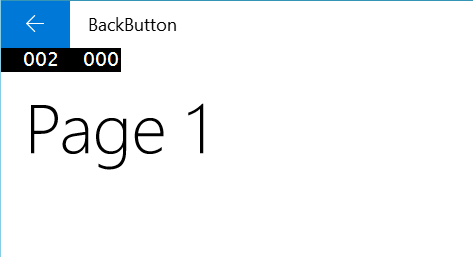
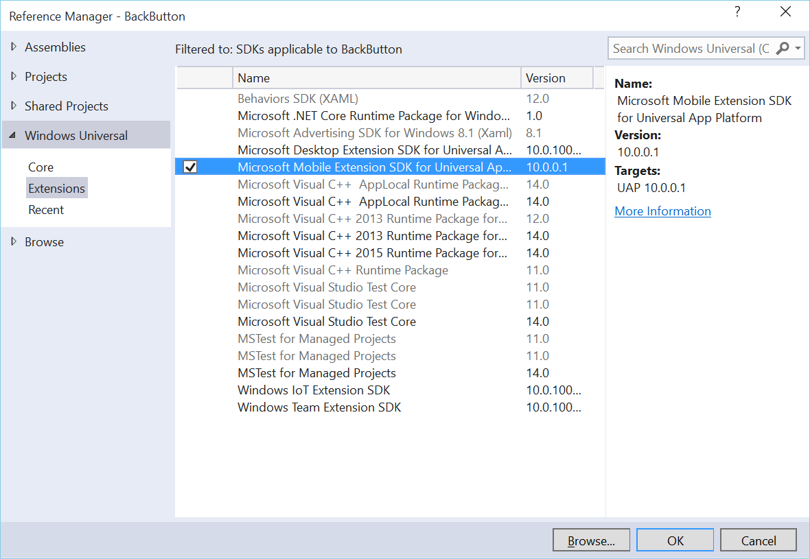

# Tlačítko Zpět v univerzálních aplikacích pro Windows 10



V _App.xaml.cs_, do metody `OnLaunched()`:

```csharp
SystemNavigationManager.GetForCurrentView().BackRequested += (s, ev) =>
{
	if (rootFrame.CanGoBack)
    	rootFrame.GoBack();
};

if (Windows.Foundation.Metadata.ApiInformation.IsTypePresent(nameof(Windows.Phone.UI.Input.HardwareButtons)))
{
	Windows.Phone.UI.Input.HardwareButtons.BackPressed += (s, ev) =>
    {
    	if (rootFrame.CanGoBack)
        	rootFrame.GoBack();
        };
}
```

_**Pozn:** Používá se nameof, takže je potřeba přidat Extension Microsoft.Mobile._



A potom na každou stránku do `OnNavigatedTo`:
```csharp
if (Frame.CanGoBack)
{
	SystemNavigationManager.GetForCurrentView().AppViewBackButtonVisibility = AppViewBackButtonVisibility.Visible;
}
else
{
	SystemNavigationManager.GetForCurrentView().AppViewBackButtonVisibility = AppViewBackButtonVisibility.Collapsed;
}
```